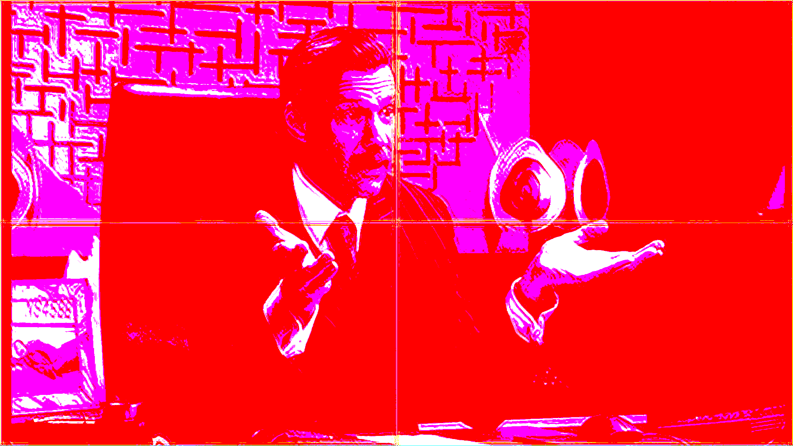
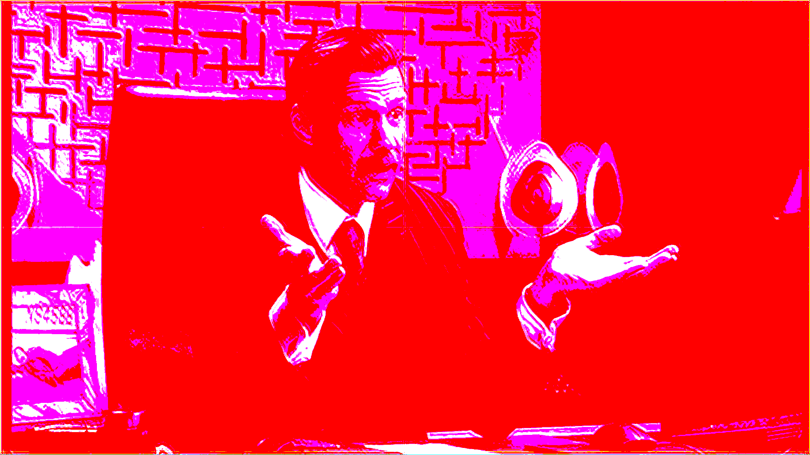

Usage
=====

.. code-block:: python

  import vapoursynth as vs
  from vapoursynth import core

  from vsgan import VSGAN

  # ...

  clip = VSGAN(clip, device="cuda").\
      load_model(r"C:\Users\PHOENiX\Documents\PSNR_x4_DB.pth").\
      run().\
      load_model(r"C:\Users\PHOENiX\Documents\4X_DoubleRunExample.pth").\
      run(overlap=16).\
      run(overlap=32).\
      clip

  # ...

  clip.set_output()

This quick example script loads VSGAN using your first CUDA-capable GPU, and runs the `PSNR_x4_DB` once
then the `4X_DoubleRunExample` model twice-over, each time with an extended seamless overlap.
It then takes the final clip, ending the VSGAN object instance and leaving you with a clip with the
models run on it.

Chaining Models
---------------

You can switch models at any time using ``load_model()``. Run can be used as many times as you want before changing
model. You have complete control.

Seamless Chunking
-----------------

VSGAN 1.4.0 or newer supports seamless chunking via the ``overlap`` parameter of ``run()``.
This tiles the model operation into 4 quadrants of the clip to lower VRAM requirements. Use this if you do not have
enough VRAM for your input image. It may affect speed, but the trade-off in VRAM may be necessary.

The overlap amount equates to the amount of pixels to overlap around seams. The seams will be removed for an
artifact-free chunk/tile operation. Accuracy is generally unaffected once you raise the value high enough to the
point you cannot see seams.

It's recommended to start at 16, and keep doubling the value until it's definitely gone for a few different types of
scenes (dark, bright, and such). You shouldn't raise the value high for the sake of it, as you will waste performance.
The amount of overlap you need will differ based on the input resolution. The larger the resolution, the larger overlap
will need to be.

What does a seam look like? Glad you asked. It looks like this:

Notice the striking lines down the center on both axes.

Seamless chunking aims to mask these naturally by extending the image input past the boundaries of each quadrant, into
each quadrant. The above example used ``overlap=1`` and is an example of an overlap amount that isn't enough.

Here's an example of an overlap amount that is just slightly too small still. You can just barely make out some seams
on the very top and left sides. This used an overlap amount of 10.
